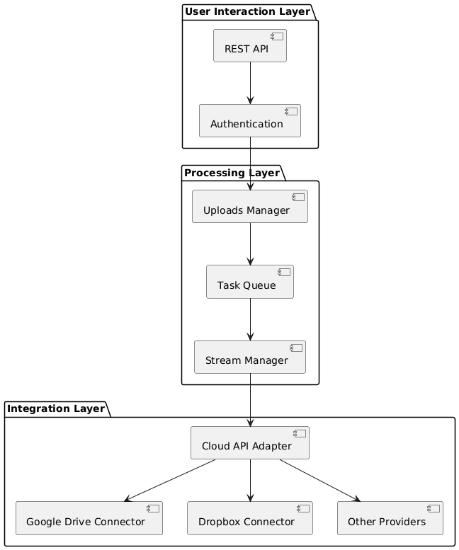

# File Uploader App Design

## Architecture Design

The system is designed with a modular and extensible architecture to support file uploads (URLs, torrents/magnet links) and integration with multiple cloud storage providers.

### Component Diagram

### Components

- **REST API**: Provides endpoints for all app functionalities.
- **Authentication**: Authentication and authorization managed with Auth0 and Passport.
- **Cloud Providers**: Manages cloud providers and their connections.
- **Stream Manager**: Streams files directly to cloud providers without server storage.
- **Task Queue**: Manages upload/download tasks efficiently.
- **Cloud API Adapter**: Abstracts cloud storage interactions for Google Drive, Dropbox, and other providers.
- **Uploads Manager**: Manages uploads and their statuses.

---

## API Design

### Authentication
1. **GET** `/auth/me`: Get the current user.

### File Upload Operations
1. **POST** `/uploads/url`: Stream a file from a URL to a cloud provider.
2. **POST** `/uploads/torrent`: Process a torrent/magnet link and stream it to a cloud provider.
3. **GET** `/uploads/{upload_id}`: Get the status of a specific upload.
4. **GET** `/uploads`: List all uploads for the user.

### Task Management
1. **GET** `/tasks/{task_id}`: Get the status of a specific task.
2. **GET** `/tasks`: List all tasks for the user.

### Cloud Integration Management
1. **GET** `/cloud-providers`: List available cloud providers.
2. **POST** `/cloud-providers/connect`: Connect a cloud provider via OAuth.
3. **DELETE** `/cloud-providers/{provider}`: Disconnect a cloud provider.

---